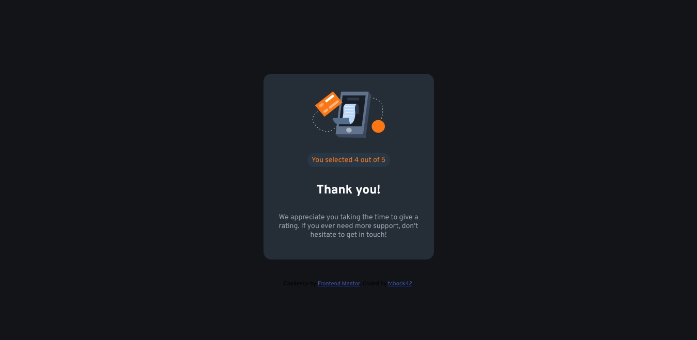

# Frontend Mentor - Interactive rating component solution

This is a solution to the [Interactive rating component challenge on Frontend Mentor](https://www.frontendmentor.io/challenges/interactive-rating-component-koxpeBUmI). Frontend Mentor challenges help you improve your coding skills by building realistic projects. 

## Table of contents

- [Overview](#overview)
  - [The challenge](#the-challenge)
  - [Screenshot](#screenshot)
  - [Links](#links)
- [My process](#my-process)
  - [Built with](#built-with)
  - [What I learned](#what-i-learned)
  - [Continued development](#continued-development)
  - [Useful resources](#useful-resources)
- [Author](#author)

## Overview

### The challenge

Users should be able to:

- View the optimal layout for the app depending on their device's screen size
- See hover states for all interactive elements on the page
- Select and submit a number rating
- See the "Thank you" card state after submitting a rating

### Screenshot

Here is the screenshot of the solution I made.

### Links

- Solution URL: [Github repository](https://github.com/tchock42/Interactive-Rating-Component-Main)
- Live Site URL: [Live Site](https://jovial-sprite-399186.netlify.app/)

## My process

### Built with

- Semantic HTML5 markup
- CSS custom properties
- Flexbox
- Mobile-first workflow

### What I learned

In this project I could apply my knowledge in javascript. This is the firt project where I used few things I just have learned. I very proud of it and it encourage me to improve.

To see how you can add code snippets, see below:

### Continued development

I am willing to learn so much more about javascript. I found javascript difficult but with some practice I will be better.

### Useful resources

- [Resources for Developers, by Developers](https://developer.mozilla.org/) - This is where I find information about html, javascript and css.
- [html color codes.](https://htmlcolorcodes.com/) - This site helps me to find colours from background and buttons.
- [w3schools.](https://www.w3schools.com/jsref/event_onclick.asp) - This site helps me to understand the onclick methode.

## Author

- Website - [tchock42](https://github.com/tchock42)
- Frontend Mentor - [@tchock42](https://www.frontendmentor.io/profile/tchock42e)

